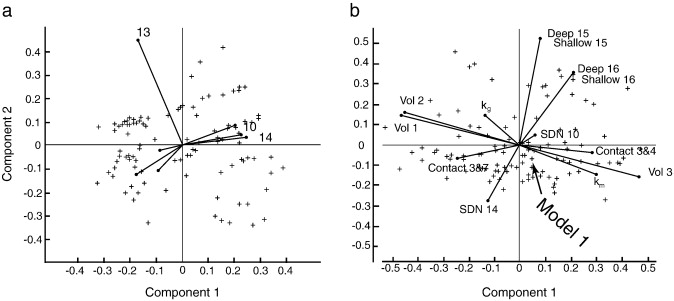

# TransD_geodiversity
Geodiversity analysis of TransD geophysical inversion model ensembles

Author: Mark Lindsay https://orcid.org/0000-0003-2614-2069

This workflow is designed to analyse model emsembles. The methods are designed to:

* define characteristics of a model that can differentiate it from others;
* find which of those characteristics measure the greatest differences;
* using those characteristics find outlier or unique models.

The 'geodiversity' concept is borrows from the work of [Lindsay et al. (2013)](https://www.sciencedirect.com/science/article/pii/S004019511300187X) who originally designed the workflow to analyse lithostratigraphic 3D geological models. 

Biplots from Lindsay et al. 2013, Figure 9.

[Principal component analysis](https://en.wikipedia.org/wiki/Principal_component_analysis) (PCA) is the statistical method used for the analysis. Refer to the orginal paper above.

This notebook deals with petrophysical models, and (so far) will only produce useful results from numeric inputs, such as density values.

## Analysis

The analysis creates three visual outputs and one tabular output.

### Scree plots
'Scree plots' show the amount of variance contained within each principal component, and is a way to understand how informative the first few components are at explaining differences between models using the metrics that characterise the models. 

The 'rule-of-thumb' is to keep enough components to explain 70-90% of variance if doing exploratory data analysis. 
You many increase the percentage explained if using the results for downstream modelling

### Biplots

A 2D biplot shows individual models from the ensemble against two selected principal components (usually PC1 and PC2) with a set of loading vectors. The loading vectors indicate correlation, so similar angles indicate closely correlated metrics. The length of the vector indicates it's influence on variance. 

### Control charts
Control charts are an outlier detection method. The chart is constructed using Hotelling's T^2 statistic to measure the distance each has from the average model. Large values indicate large distances, and greater divergence from the average model as defined by the geodiversity metrics. 

Additional details are found in the notebook.

* There are plans to add additional metrics. Happy to take any suggestions, or have you add your own.
